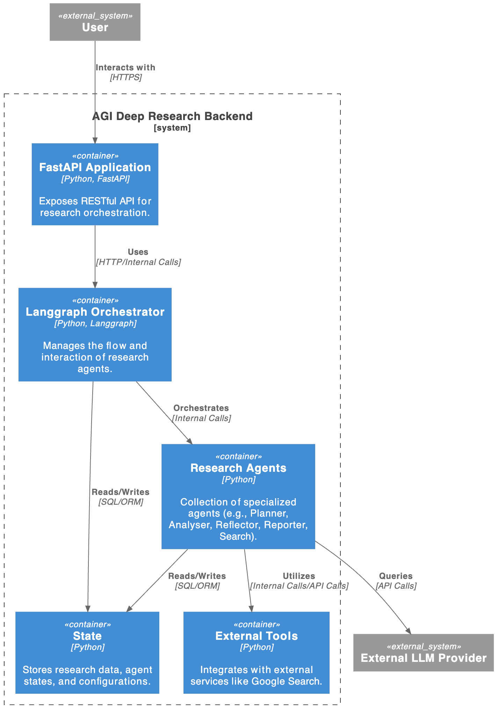

# GenAI Deep Research API

## Description
This project serves as the backend for a GenAI Deep Research application, utilizing FastAPI for the API and Langchain/Langgraph for orchestrating research agents.

## Features
-   **Modular Agent System**: Designed with various agents (Planner, Analyser, Reflector, Reporter, Search) for different research tasks.
-   **Google Search Integration**: Leverages Google Search for information retrieval.
-   **FastAPI**: Provides a robust and scalable API for interaction.
-   **Langchain/Langgraph**: Orchestrates complex research workflows.
-   **Secure and Ethical by Design**: Implements strict security protocols and an ethical charter to ensure safe and responsible operation.

## Architecture

The system architecture is documented using PlantUML following the C2 model. The diagram can be found in `Architecture.puml`.

To view the diagram:
1. Install PlantUML (e.g., via `brew install plantuml` or download from [plantuml.com](https://plantuml.com/download)).
2. Render the diagram using the command: `plantuml Architecture.puml`
3. Alternatively, use an online PlantUML viewer or a VSCode extension.



## Installation

1.  **Clone the repository**:
    ```bash
    git clone https://github.com/faawx/genai-generic-research-api.git
    cd genai-generic-research-api
    ```

2.  **Create a virtual environment**:
    ```bash
    python -m venv venv
    source venv/bin/activate  # On Windows, use `venv\Scripts\activate`
    ```

3.  **Install dependencies**:
    ```bash
    pip install -r requirements.txt
    ```

4.  **Set up environment variables**:
    Create a `.env` file in the root directory of the project and add the following environment variables:

    ```
    GOOGLE_API_KEY="your_google_api_key"
    GOOGLE_SEARCH_API_KEY="your_google_search_api_key"
    GOOGLE_CSE_ID="your_google_custom_search_engine_id"
    LANGSMITH_TRACING=true
    LANGSMITH_ENDPOINT=https://api.smith.langchain.com
    LANGSMITH_API_KEY="your_langsmith_api_key"
    LANGSMITH_PROJECT="your_langsmith_project_name"
    ```
    Replace the placeholder values with your actual API keys and project name.

## Usage

To run the application, use Uvicorn:

```bash
uvicorn main:app --reload
```

The API will be available at `http://127.0.0.1:8000`. You can access the API documentation at `http://127.0.0.1:8000/docs`.

## Security

This project implements a multi-layered security approach, addressing both application-level and development lifecycle risks. The full security policy can be found in [SECURITY.md](./SECURITY.md).

Key security measures include:
- **Prompt Injection Defense:** Input validation and hardened prompts to prevent malicious instructions.
- **Sensitive Information Redaction:** Sanitization of outputs to prevent PII leakage.
- **Denial of Service Prevention:** Limits on input length and research loops.
- **Restricted Agency:** The agent's only tool is Google Search, with no access to the file system or network.
- **Secure Development:** The CI/CD pipeline includes automated secret scanning, static analysis (SAST), and dependency scanning (SCA).

## Ethical Charter

The agent is designed with a strong ethical framework, detailed in the [ETHICS.md](./ETHICS.md) file. This charter is technically enforced through a `SAFETY_CONSTITUTION` implemented in the agent's logic.

Core principles include:
- **Harmlessness:** Refusing to research dangerous or illegal topics.
- **Privacy:** Redacting Personally Identifiable Information (PII).
- **Objectivity:** Grounding answers in verifiable search results.
- **Robustness:** Limiting agent capabilities to prevent misuse.

## Project Structure

```
.
├── api/                  # API endpoints
├── deep_research/        # Core research logic and agents
│   ├── nodes/            # Individual research agents
│   └── tools/            # Tools used by agents (e.g., Google Search)
├── main.py               # Main application entry point
├── requirements.txt      # Python dependencies
└── README.md             # Project documentation
```


